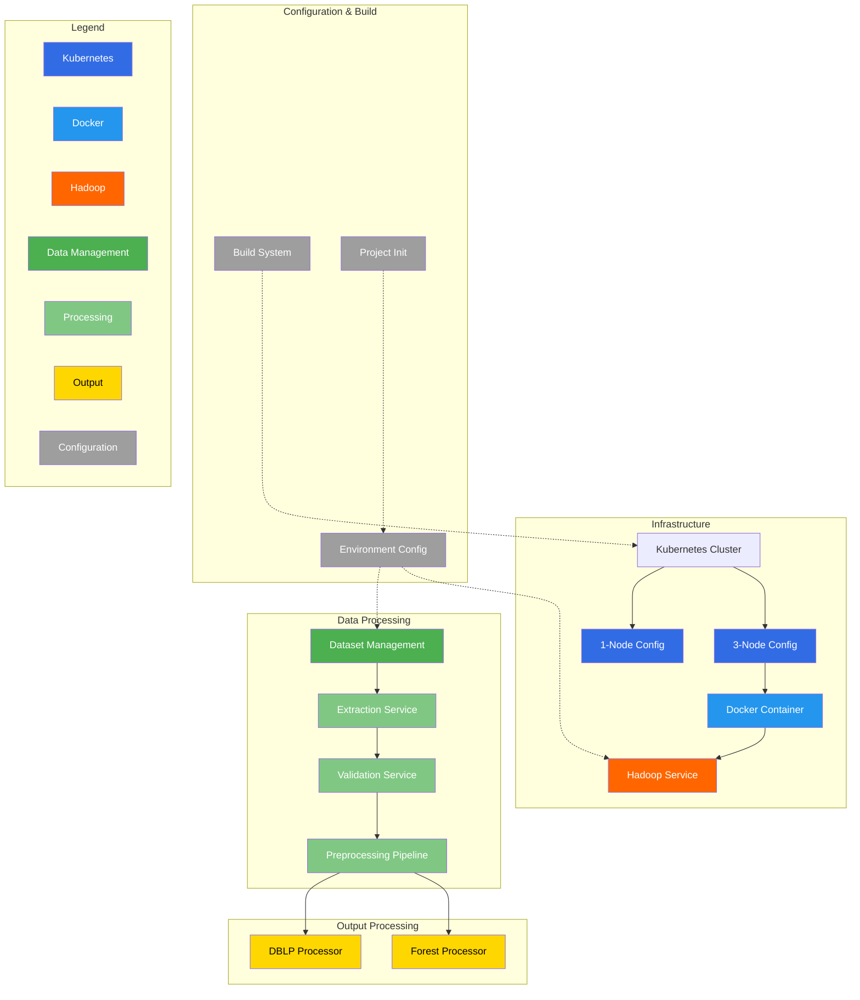

# Hadoop_bigdata_analysis

## 项目介绍

本项目为 GZHU 电信学院22级学生大数据期末作业

题目要求：Hadoop是Google的云计算技术的开源实现，Mahout是Hadoop中关于分布式大数据分析的一个模块。

- 利用Hadoop中的Mahout搭建分布式大数据分析平台，该平台中至少有3个以上客户端，并完成以下3个任务：
- 针对DBLP数据集(<https://dblp.uni-trier.de/xml/>，利用Hadoop中的Mahout实现一种基于分布式架构的频繁项集挖掘算法(例如，FP) Growth算法)。针对同一种算法和数据集，把分布式架构的和非分布式架构下的性能进行比较，例如，挖掘时间、挖掘性能等；
- 针对ImageNet数据集，利用Hadoop中的Mahout实现一种基于分布式架构的分类算法；针对同一种算法和数据集，把分布式架构的和非分布式架构下的性能进行比较，例如，分类时间、分类性能等；
- 自行选择一个至少包含5万个对象的公开数据集，针对该数据集，利用Hadoop中的Mahout实现一种基于分布式架构的聚类算法；针对同一种算法和数据集，把分布式架构的和非分布式架构下的性能进行比较，例如，聚类时间、聚类性能等；
- 人数：4-5人；

Mahout可参考，<https://mahout.apache.org/>

## 项目结构

```txt
.
├── datasets
│  ├── extract
│  └── validate.py
├── deploy
│  ├── docker
│  │  └── mahout
│  └── k8s
│     ├── Dockerfile
│     ├── download.sh
│     ├── Makefile
│     ├── value-1node.yaml
│     └── value-3node.yaml
├── Makefile
├── output
│  ├── DBLP
│  │  ├── DBLP.xml
│  │  ├── mahout_run.sh
│  │  ├── preprocessing.sh
│  │  └── view.sh
│  └── forest
│     ├── covtype.csv
│     ├── mahout_run.sh
│     ├── preprocessing.sh
│     ├── readme.md
│     └── view.sh
├── poetry.lock
├── pyproject.toml
├── readme.md
├── script
│  ├── data_preprocessing.sh
│  ├── data_put2hdfs.sh
│  ├── init_project.sh
│  ├── kube_cp.sh
│  ├── split_DBLP.sh
│  ├── start_hadoop_service.sh
│  └── unzip.sh
└── src
   ├── DBLP
   ├── forest
   └── ImageNet
```

## 系统架构


